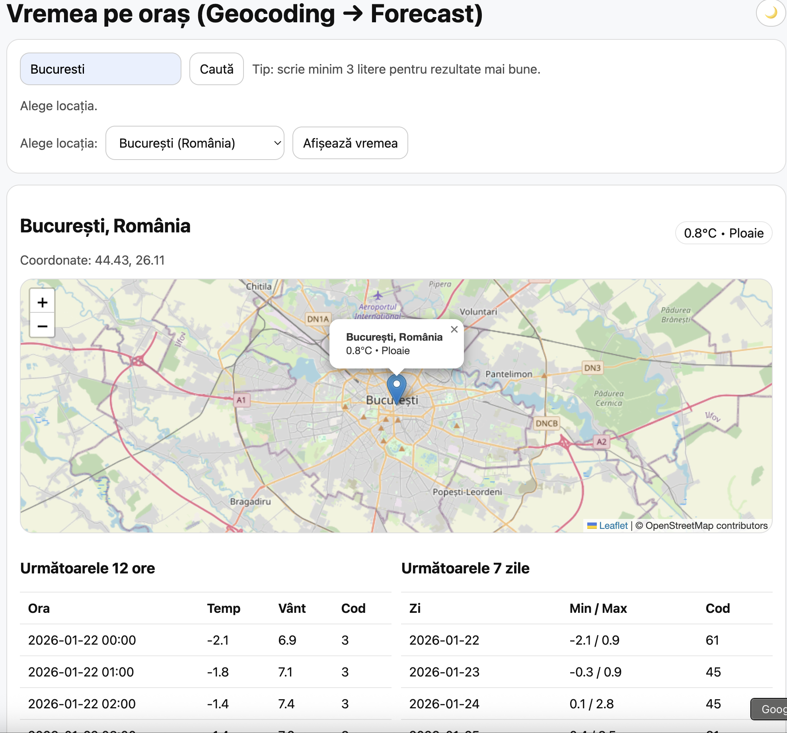
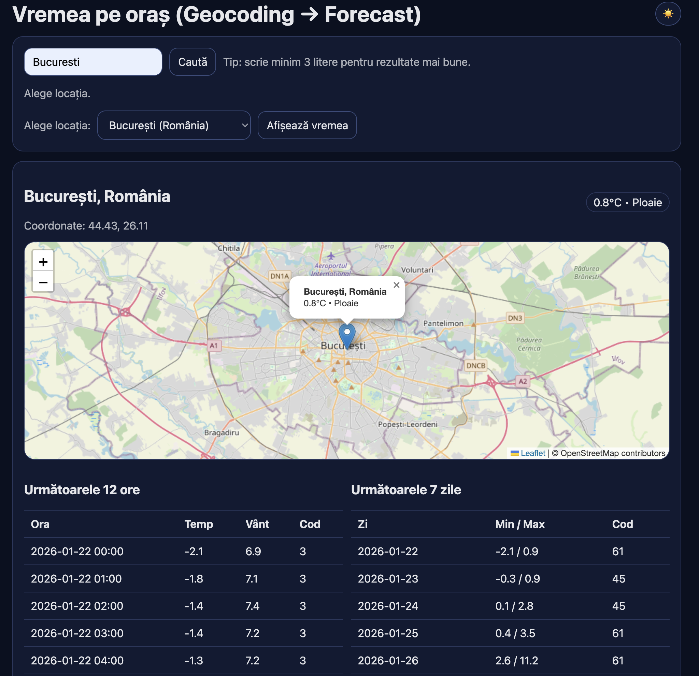

# Weather App – Open-Meteo 

Aplicație web simplă care afișează vremea pentru un oraș ales, folosind API-urile **Open-Meteo** și o hartă interactivă cu **Leaflet**.

## Funcționalități
- Căutare oraș (geocoding)
- Selectarea locației din mai multe rezultate
- Afișarea vremii curente
- Prognoză pe următoarele 12 ore și 7 zile
- Hartă interactivă cu marker
- Dark / Light mode (salvat în `localStorage`)

## Tehnologii folosite
- HTML
- CSS / SCSS (compilat cu Sass)
- JavaScript (ES Modules)
- Open-Meteo API
- Leaflet.js

### Light mode


### Dark mode


## Rulare proiect
1. Deschide proiectul într-un browser (recomandat prin Live Server).
2. Pentru stiluri (SCSS → CSS):
```bash
npx sass --watch styles.scss:styles.css